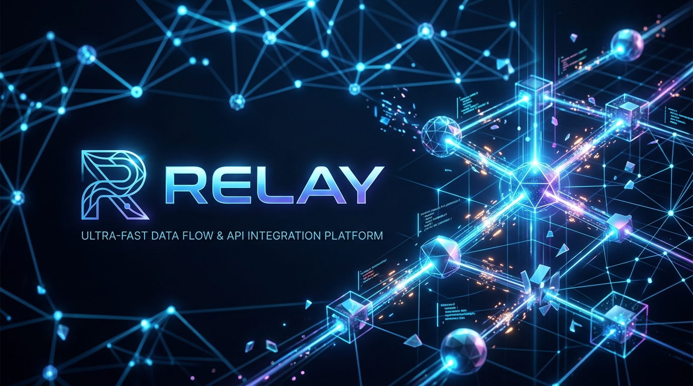

<div align="center">
  

  <p>
    <a href="https://github.com/akshat3410/Relay-check"></a>
    <a href="./LICENSE"></a>
  </p>
</div>

---

**Relay** gives your AI coding assistant a structured review methodology — turning it into a Senior QA Engineer, Security Auditor, Tech Lead, or Release Manager on demand.

Relay provides a set of highly optimized, **Agent-Native Skills and Workflows** that install directly into your favorite AI developer assistants (Claude Code, Google Antigravity, Cursor, or GitHub Copilot) as native slash commands.

No complex local AST binaries, no heavy dependency footprint. Your assistant executes the review natively using its workspace-inspection tools (listing files, reading source code, and running grep) to make highly accurate, context-aware decisions.

---

## How It Works

1. **Install Skills** — Run the automated installer inside any project directory:
   ```bash
   npx @akshat3410/relay install-skills
   ```
2. **Trigger Commands** — Use native slash commands or custom workflows directly inside your AI assistant's chat (e.g., `/relay-qa`, `/relay-security`).
3. **Get Results** — The assistant applies Relay's precise checklist methodology and outputs a structured Markdown report with a clear decision.

---

## Installation

Run the following command inside your project directory to install Relay skills:

```bash
npx @akshat3410/relay install-skills
```

By default, Relay automatically installs all skills **locally** (for the current workspace) and **globally** (across your entire machine) for all detected assistant providers.

### Supported Assistant Integration

| Assistant | Local Slash Command / Workflow Path | Global Installation Path |
| :--- | :--- | :--- |
| **Claude Code** | `/relay-<skill>` via `.claude/commands/` | `~/.claude/commands/` |
| **Google Antigravity** | `/relay-<skill>` via `.agents/workflows/` | `~/.gemini/config/global_workflows/` |
| **Cursor** | Persisted rules under `.cursor/rules/` | Persistent instructions |
| **GitHub Copilot** | Appended to `.github/copilot-instructions.md` | Persistent prompts |

---

## Core Skills & Slash Commands

Every skill is structured as an agent-native instruction set and can be invoked natively using slash commands.

---

### `/relay-qa` — Full QA Review

The most comprehensive project audit. Evaluates code quality, security, performance, accessibility, and release readiness to calculate a weighted overall score [0-100] and make a definitive `SHIP / WARN / HOLD` decision.

| Category | Weight | Focus Areas |
| :--- | :---: | :--- |
| **Security** | 30% | OWASP Top 10, secrets in source code, input validation |
| **Testing** | 20% | Coverage, assertion quality, focused/skipped tests |
| **Architecture** | 20% | Layering, cohesion, circular dependencies, God files |
| **Performance** | 10% | Bundle tree-shaking, lazy-loading, N+1 query patterns |
| **Accessibility** | 10% | Semantic HTML, ARIA labels, keyboard focus |
| **Release Readiness** | 10% | Version verification, changelogs, configuration templates |

---

### `/relay-security` — OWASP Security Audit

An intensive security assessment mapped directly against the OWASP Top 10 vulnerabilities (including injection, broken access control, cryptographic failures, and insecure design). Returns `SECURE / REVIEW NEEDED / VULNERABLE`.

---

### `/relay-release` — Release Readiness Check

Gates your code before shipping. Verifies dependency lockfile health, floating production dependencies, changelog entries, version increments, container user privileges, and environment variable templates. Returns a clear `GO / NO-GO` verdict.

---

### `/relay-performance` — Performance Audit

Identifies frontend and backend bottlenecks. Audits asset and image lazy-loading, dynamic importing, monolithic library tree-shaking, HTTP caching headers, and database query pagination.

---

### `/relay-testing` — Test Quality Verification

Audits the reliability and coverage of your test suite. Finds accidentally committed `.only`/`.skip` focus markers, empty test files, dummy placeholder assertions, and brittle over-mocking patterns.

---

### `/relay-architecture` — Code Architecture Audit

Evaluates the structural health and separation of concerns of the codebase. Flags monolithic dependencies, circular imports, deep relative paths (`../../../../`), and bloated files exceeding 1000 lines of code.

---

## Backward Compatibility (CLI Mode)

Relay maintains full backward compatibility for automated CI pipelines and pre-existing integrations:

```bash
relay version                              # Prints current version
relay review --format json --cwd .         # Generates static JSON results
```

---

## Contributing

We welcome contributions! Please see our [Contributing Guide](./docs/CONTRIBUTING.md) to get started.

MIT © Relay Contributors
